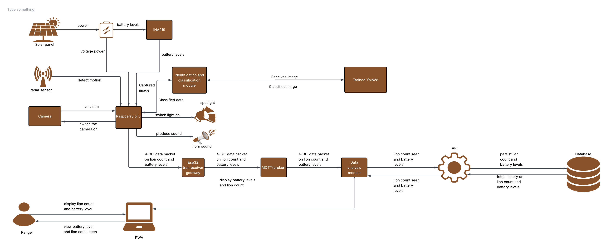

# System Architecture Blueprint

Mara Guard is a smart, solar-powered security network built for the field. It uses edge AI to process camera and sensor data right on the spot, triggering immediate alarms while pushing live tracking updates straight to the rangers' dashboard.

---

## 1. End-to-End System Architecture Map

Below is the complete system map tracking data loops from local solar power harvesting up to database record storage:

---

## 2. Detailed Technical Block Breakdown

### Power Generation & Diagnostic Management

* **Solar Panel Matrix:** Charges the central battery bank in remote field areas to maintain autonomous, off-grid network lifespan.
* **Power Module:** Conditions input lines and scales voltage thresholds safely for system-side delivery.
* **INA219 Chip Sensor:** Samples high-side voltage and current values directly from the Power Module, feeding live battery health analytics over the I2C bus into the primary processor core.

### Local Ingestion, Inference & Deterrence (The Field Node)

* **Multimodal Edge Sensing:** Ingests synchronized environmental streams via a high-definition **Camera Module** (live video) and an **Ultrasonic Proximity Sensor** (target space parameters).
* **Raspberry Pi 5 Compute Engine:** Runs local target tracking and edge computation loops. Raw frames are passed natively through a localized **YOLOv8 target detection pipeline**.
* **Isolated Actuators / Deterrents:** If the classification engine flags a verified threat, the Pi pulls designated relay pins high to trigger physical counter-measures instantly, firing the **high-intensity spotlight** and the **acoustic alert horn** simultaneously.

### Backhaul, Brokerage & Processing Tier

* **Paylink Gateway / Router:** Collects point-to-point data packets containing location telemetry, incident metrics, and power health indices from the edge node.
* **MQTT Broker Core:** Translates raw ingestion signals into standardized JSON payloads, routing tracking lines through explicit pub/sub communication topics.
* **Train Analysis Module:** Manages active system workflows. It interacts with the **Trained Model Core** container to optimize tracking weights and feeds real-time status arrays down to the **Ranger Mobile PWA Dashboard**.

### Core API & Long-Term Data Persistence

* **Service API Gears:** Exposes secure REST endpoints to handle management workflows, including ranger sign-ins, individual edge node configuration switches, and analytical log aggregation queries.
* **Relational Database Storage:** Acts as the final system storage layer, indexing localized incident tracking data, node diagnostic telemetry, and chronological ranger response logs.

---

## 3. Communication Protocols & Data Contracts

To make sure the system works perfectly across remote field locations, the different components use specific communication steps to talk to each other. 

First, because the remote field node sits out in the wild without standard internet or cellular data, it packages its logs into a tiny, compressed chunk of data and sends it over long-range radio waves directly to our base station gateway. This uses very little battery power and works completely independently of local cell towers.

Once the gateway receives that raw radio signal, it connects to our local network and translates that compressed package into a clean text format. It then hands this off to an MQTT traffic broker, which instantly sorts and directs the data streams where they need to go. 

From there, the backend analysis hub stays continuously connected to the ranger mobile app using persistent web channels. The moment a lion is detected, a live notification is pushed straight to the rangers' screens in less than half a second. Finally, all the other internal dashboard controls, user log-ins, and standard data query tools communicate safely behind the scenes using secure web addresses to transfer structured logs across the entire ecosystem.

---

## 4. System Isolation & Fail-Safe Protocols

* **Power Safety Margins:** The INA219 power tracker checks that high-inductive actuator draws (spotlight/horn) do not cross dangerous limits, preventing field crashes due to battery exhaustion.
* **Offline Routing Fallbacks:** If the gateway internet uplink drops out entirely, the Train Analysis Module queues incoming data packets internally to ensure data stays preserved until the system reconnects.
