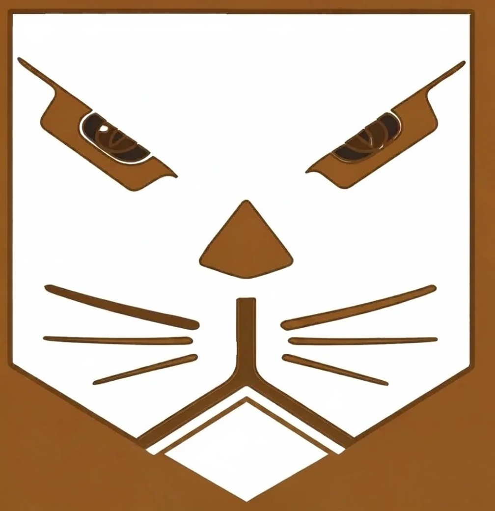
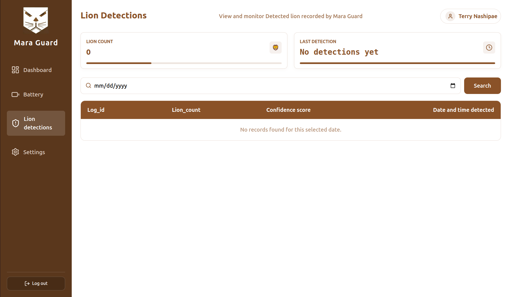

# Welcome to Mara Guard

  

    
    <h2>Coexistence. Protection. Innovation.</h2>
    
An autonomous, edge-AI conflict mitigation network safeguarding livestock and lions.

  

  

    
    <h2>Incident Alerts. Telemetry. Analytics.</h2>
    
Empowering field rangers and Maasai pastoralists with proactive regional tracking tools.

  

  

    
    <h2>On-Board Neural Network Verification</h2>
    
Solar-powered edge nodes running local machine vision scripts in any weather state.

  

  

    
    
    
  

  <a href="https://voxels-informational-website.vercel.app/" class="md-button">Informational Website</a>
  <a href="getting-started/" class="md-button">See what's next</a>

---

  <strong>Mara Guard</strong> is an edge-AI ecosystem designed by the Voxels engineering team, 
  connecting standalone solar telemetry nodes with localized YOLOv8 neural network matching loops, streamlining automated threat interception and  enabling wildlife rangers to track active intrusions and monitor device health metrics via point-to-point radio linkages thereby enhancing community-led conservation.
 

---
## Why Mara Guard?

  <h3>Edge-AI Threat Classification</h3>
  
Executes optimized convolutional inference maps locally on an integrated Raspberry Pi 5 host processor, achieving real-time predator verification within 12.3ms of signal ingestion.

  <h3>All-Weather Microwave Radar</h3>
  
Employs standalone radar tracking arrays to monitor boundary perimeters up to 6 meters deep, completely filtering out adverse field elements like heavy rain, dust storms, dense fog, or midnight thermal distortion.

  <h3>Layered Autonomous Countermeasures</h3>
  
Triggers dual startle-defense circuits instantly upon threat validation—switching on high-lumen spotlights to disorient nocturnal tracking vision while blasting high-decibel horns continuously until all lions clear the zone.

  <h3>Long-Range Radio Telemetry (LoRa)</h3>
  
Bypasses commercial cellular infrastructure dependencies by packaging active incident logs into compact binary streams, broadcasting them across isolated territories using point-to-point LoRa radio link arrays.

  <h3>Empirical Precision & False-Alarm Rejection</h3>
  
Enforces a strict 60% validation threshold via anchor-free neural detection heads, ensuring the node automatically ignores non-threatening movement like wind-blown brush, domestic herding dogs, or livestock cattle.

  <h3>Real-Time Ranger Analytics Hub</h3>
  
Funnels incoming gateway telemetry over an automated MQTT broker path to populate custom web management panels with real-time intrusion lists, historic trend timelines, predator densities, and INA219 battery voltage records.

---

---

  <strong>Our Mission:</strong> <em>Mitigate escalating human-wildlife conflict within the Maasai Mara Reserve ecosystem. 
  Replace dangerous field blindspots with secure, trackable edge-intelligence arrays built to protect communal assets and preserve vulnerable lion prides.</em>

---

> _Learn more about Mara Guard on our [Informational Portal](https://voxels-informational-website.vercel.app/)._  
> _Ready to build the edge node hardware stack? [Jump to the Getting Started Guide](getting-started.md)!_

