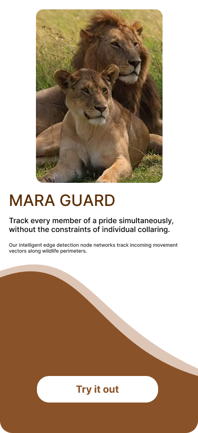
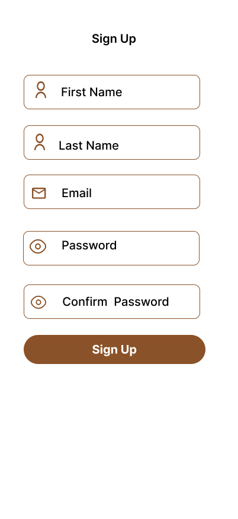
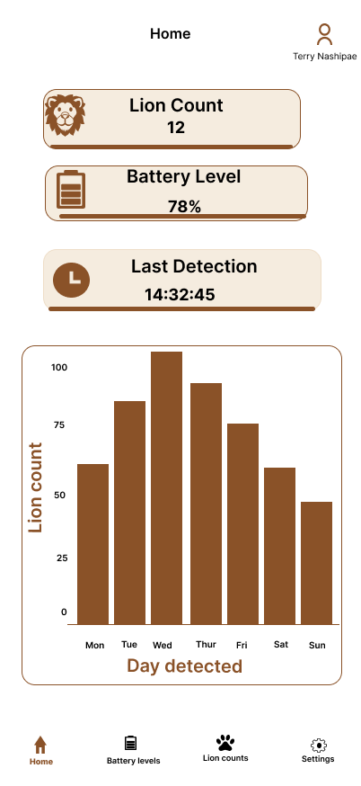

# Mobile Development Architecture

The Mara Guard mobile application is a high-performance, low-latency field dashboard designed for park rangers operating within the Maasai Mara National Reserve. It processes incoming edge alerts from the base gateway and provides instant spatial and visual telemetry under demanding network conditions.

---

## 1. Application Architecture & Data Flow

The mobile layer operates as a reactive frontend interface. It maintains a persistent connection to the central gateway via a lightweight messaging protocol to handle rapid updates during critical wildlife encounters.

<div style="color: #bd936e; font-family: monospace; font-size: 15px; font-weight: bold; line-height: 1.8; white-space: pre; overflow: none; padding: 15px 0; text-align: center;">
[ MQTT BROKER ] &rarr;&rarr;&rarr;&rarr; ( WebSockets / TLS ) &rarr;&rarr;&rarr;&rarr; [ MOBILE ENDPOINT ]
                                                             |
                                           +-----------------+-----------------+

                                           |                 |                 |
                                           v                 v                 v
                                  [ LIVE ALERT FEED ] [ TELEMETRY CACHE ] [ GEOSPATIAL MAP ]
                                  (YOLOv8 Target Data) (INA219 System Logs) (Node Coordination)
</div>

---

## 2. Core Functional Requirements

### Real-Time Alert Ingestion

* **Instant Notifications:** Uses WebSocket channels over an MQTT broker to push immediate, high-priority audio and visual warnings to the ranger's device when a lion profile matches class conditions.
* **Incident Payload:** Displays the unique hardware Node ID, accurate timestamp, classification confidence metric, and the latest camera frame thumbnail if available.

### Field Telemetry Monitoring

* **Battery Diagnostics:** Decodes data stream payloads parsed from the field node's **INA219 current monitor** to display a clean battery health gauge (Voltage, Current Draw, and Percentage).
* **Connection Status:** Shows active heartbeats for the point-to-point **LoRa radio frequency loops** so rangers know if a remote node goes offline.

### Offline Capability & Data Persistence

* **Local Caching:** Utilizes local database stores to index historical incident logs, ensuring past alerts remain fully readable when rangers track targets outside cellular coverage zones.
* **Sync Strategy:** Queues localized user telemetry responses or state acknowledgments, auto-syncing with the primary network database the moment a reliable link re-establishes.

---

## 3. API & Messaging Payloads

The application subscribes to specific device topics to ingest JSON structures emitted by the gateway router.

### Sample Alert Payload (`maraguard/nodes/+/alerts`)

<div style="color: #bd936e; font-family: monospace; font-size: 15px; font-weight: bold; line-height: 1.6; overflow-x: auto; padding: 15px; text-align: left;">
{
  "node_id": "MG-NODE-05",
  "timestamp": "2026-08-28T18:10:00Z",
  "target_class": "lion",
  "confidence": 0.94,
  "deterrents_triggered": ["spotlight", "acoustic_horn"],
  "battery": {
    "voltage_v": 11.85,
    "current_ma": 420.0,
    "capacity_percent": 82.5
  }
}
</div>

```

---

## 4. Technical Stack & Dependencies

* **Frontend Framework:** Optimized PWA (Progressive Web App) architecture or cross-platform framework (e.g., Flutter / React Native) for rapid resource rendering on low-tier field devices.
* **Network Protocol:** `MQTT.js` or standard WebSocket clients wrapper using TLS security layers for safe data routing over open wireless networks.
* **Mapping Engine:** Vector-based tile maps with offline caching support to ensure terrain navigation remains entirely operational without live internet access.

---

## 5. UI/UX Field Standards

* **Night-Mode Optimization:** High-contrast, dark-mode default UI styling designed to protect the night vision of rangers during nocturnal tracking and field patrols.
* **Acoustic Overrides:** High-intensity custom alert tones that override standard system volumes when critical, immediate wildlife conflicts take place near nearby livestock bomas.

---

## 6. Field Wireframe Implementations

Below are the interface layout specifications optimized for field deployment and ranger tracking operations:

### Gateway & Authentication Layouts

* **Landing Splash Screen:** Main introduction portal featuring the localized lion pride movement monitoring copy and explicit entry buttons.

<div style="text-align: center; padding: 20px 0;">
  
</div>

* **Sign Up Registration Screen:** Cryptographic field inputs for First Name, Last Name, Email, and Passwords to authenticate field devices onto the reserve network broker safely.

<div style="text-align: center; padding: 20px 0;">
  
</div>

### Core Operational Interfaces

* **Home Page Dashboard Screen:** Main tracking navigation center displaying active alert feeds, dynamic wildlife metrics, localized map view nodes, and current diagnostic tracing flags.

<div style="text-align: center; padding: 20px 0;">
  
</div>
