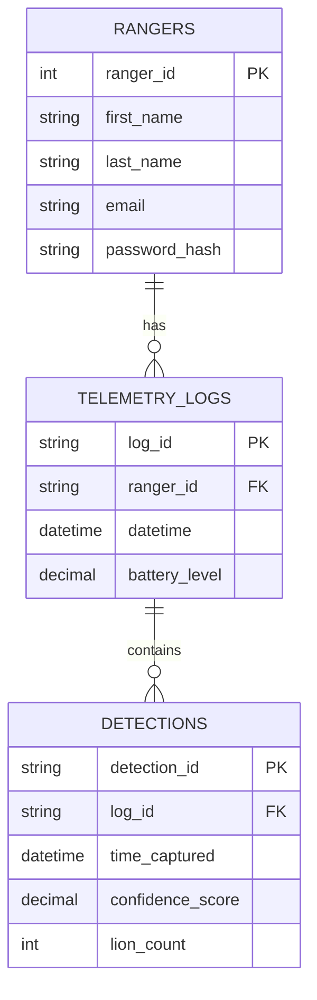

<div class="api-page">

<div class="api-hero">
  <h1>Backend</h1>
  <p class="hero-subtitle">Mara Guard API - FastAPI backend for Voxels wildlife monitoring system.</p>
  <div class="tech-badges">
    <span class="tech-badge">FastAPI</span>
    <span class="tech-badge">PostgreSQL</span>
    <span class="tech-badge">SQLAlchemy 2.0</span>
    <span class="tech-badge">JWT</span>
    <span class="tech-badge">Redis</span>
    <span class="tech-badge">Alembic</span>
    <span class="tech-badge">Python 3.12</span>
  </div>
</div>

<script>
document.addEventListener('DOMContentLoaded', function() {
  if (typeof mermaid !== 'undefined') {
    mermaid.initialize({
      startOnLoad: true,
      theme: 'dark',
      themeVariables: {
        primaryColor: '#2D1A10',
        primaryTextColor: '#FFFFFF',
        primaryBorderColor: '#CD8151',
        lineColor: '#CD8151',
        secondaryColor: '#3D2A1E',
        tertiaryColor: '#1a0f0a',
        background: '#1a0f0a',
        mainBkg: '#2D1A10',
        nodeBorder: '#CD8151',
        clusterBkg: '#3D2A1E',
        titleColor: '#FFFFFF',
        edgeLabelBackground: '#2D1A10',
        fontFamily: 'Poppins, Segoe UI, Arial, sans-serif',
        relationshipLabelColor: '#CD8151',
        relationshipLineColor: '#CD8151'
      },
      er: {
        layoutDirection: 'LR',
        minEntityWidth: 180,
        minEntityHeight: 110,
        entityPadding: 25,
        fontSize: 15
      },
      flowchart: {
        useMaxWidth: true,
        htmlLabels: true,
        curve: 'basis'
      }
    });
  }
});
</script>
<script type="module">
  import mermaid from 'https://cdn.jsdelivr.net/npm/mermaid@10/dist/mermaid.esm.min.mjs';
  window.mermaid = mermaid;
  mermaid.initialize({
    startOnLoad: true,
    theme: 'dark',
    themeVariables: {
      primaryColor: '#2D1A10',
      primaryTextColor: '#FFFFFF',
      primaryBorderColor: '#CD8151',
      lineColor: '#CD8151',
      secondaryColor: '#3D2A1E',
      tertiaryColor: '#1a0f0a',
      background: '#1a0f0a',
      mainBkg: '#2D1A10',
      nodeBorder: '#CD8151',
      clusterBkg: '#3D2A1E',
      titleColor: '#FFFFFF',
      edgeLabelBackground: '#2D1A10',
      fontFamily: 'Poppins, Segoe UI, Arial, sans-serif',
      relationshipLabelColor: '#CD8151',
      relationshipLineColor: '#CD8151'
    },
    er: {
      layoutDirection: 'LR',
      minEntityWidth: 180,
      minEntityHeight: 110,
      entityPadding: 25,
      fontSize: 15
    },
    flowchart: {
      useMaxWidth: true,
      htmlLabels: true,
      curve: 'basis'
    }
  });
</script>
</div>

<div class="api-section">

<div class="section-title">Database Schema</div>

<p>PostgreSQL database with SQLAlchemy 2.0 ORM and Alembic migrations.</p>

<div class="erd-wrapper">
<div class="erd-glow"></div>
<div class="erd-container">



</div>
</div>

</div>

<div class="api-section">

<div class="section-title">Live API Docs</div>

<ul>
  <li><a href="https://maraguard-3686f239afe8.herokuapp.com/docs" target="_blank">Swagger UI</a></li>
  <li><a href="https://maraguard-3686f239afe8.herokuapp.com/redoc" target="_blank">ReDoc</a></li>
</ul>

</div>

<div class="api-section">

<div class="section-title">Data Models</div>

<h3 class="subsection-title">Ranger</h3>

<div class="styled-table-wrapper">
<table class="styled-table">
  <thead>
    <tr>
      <th>Field</th>
      <th>Type</th>
      <th>Description</th>
    </tr>
  </thead>
  <tbody>
    <tr>
      <td>ranger_id</td>
      <td>Integer</td>
      <td>Primary key</td>
    </tr>
    <tr>
      <td>first_name</td>
      <td>String(100)</td>
      <td>Ranger's first name</td>
    </tr>
    <tr>
      <td>last_name</td>
      <td>String(100)</td>
      <td>Ranger's last name</td>
    </tr>
    <tr>
      <td>email</td>
      <td>String(100)</td>
      <td>Unique email address</td>
    </tr>
    <tr>
      <td>password_hash</td>
      <td>String(255)</td>
      <td>Bcrypt hashed password</td>
    </tr>
  </tbody>
</table>
</div>

<h3 class="subsection-title">Detection</h3>

<div class="styled-table-wrapper">
<table class="styled-table">
  <thead>
    <tr>
      <th>Field</th>
      <th>Type</th>
      <th>Description</th>
    </tr>
  </thead>
  <tbody>
    <tr>
      <td>detection_id</td>
      <td>String(36)</td>
      <td>UUID primary key</td>
    </tr>
    <tr>
      <td>log_id</td>
      <td>String(36)</td>
      <td>Associated telemetry log</td>
    </tr>
    <tr>
      <td>time_captured</td>
      <td>DateTime</td>
      <td>Timestamp of detection</td>
    </tr>
    <tr>
      <td>confidence_score</td>
      <td>Numeric(3,2)</td>
      <td>AI confidence (0.00 - 1.00)</td>
    </tr>
    <tr>
      <td>lion_count</td>
      <td>Integer</td>
      <td>Number of lions detected</td>
    </tr>
  </tbody>
</table>
</div>

<h3 class="subsection-title">Telemetry Log</h3>

<div class="styled-table-wrapper">
<table class="styled-table">
  <thead>
    <tr>
      <th>Field</th>
      <th>Type</th>
      <th>Description</th>
    </tr>
  </thead>
  <tbody>
    <tr>
      <td>log_id</td>
      <td>String(36)</td>
      <td>UUID primary key</td>
    </tr>
    <tr>
      <td>ranger_id</td>
      <td>String(36)</td>
      <td>Ranger who created the log</td>
    </tr>
    <tr>
      <td>datetime</td>
      <td>DateTime</td>
      <td>Log timestamp</td>
    </tr>
    <tr>
      <td>battery_level</td>
      <td>Numeric(10,2)</td>
      <td>Battery percentage (0 - 100)</td>
    </tr>
  </tbody>
</table>
</div>

</div>

<div class="api-section">

<div class="section-title">Libraries & Methods</div>

<p>FastAPI, PostgreSQL, SQLAlchemy 2.0, JWT (HS256), Redis, Alembic, Bcrypt, Pydantic.</p>

<p>POST, GET, PATCH, DELETE methods with JWT authentication and IP-based rate limiting.</p>

</div>

<div class="api-section">

<div class="section-title">Testing</div>

<p>pytest for unit tests. Run with:</p>

```bash
pytest
```

</div>

<div class="api-section">

<div class="section-title">Deployment</div>

<p>Platform: Heroku (Staging & Production)</p>

<p>Branch: Deploy from main</p>

<p>Environment variables managed in Heroku dashboard.</p>

<p>Auto-scaling via Heroku dynos.</p>

<p>Rollback to previous release via Heroku dashboard.</p>

</div>

</div>
