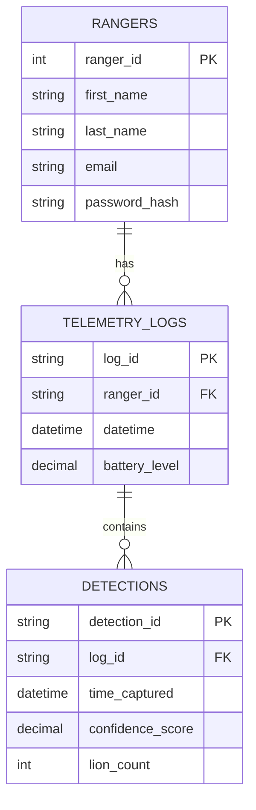

<div class="api-page">

<div class="api-hero">
  <h1>Backend</h1>
  <p class="hero-subtitle">Welcome to the <strong>Voxels API Reference</strong>! Here you'll find everything needed to integrate, test, and explore the REST endpoints powering Voxels' wildlife monitoring system.</p>
  <div class="tech-badges">
    <span class="tech-badge">FastAPI</span>
    <span class="tech-badge">PostgreSQL</span>
    <span class="tech-badge">SQLAlchemy 2.0</span>
    <span class="tech-badge">JWT</span>
    <span class="tech-badge">Redis</span>
    <span class="tech-badge">Alembic</span>
    <span class="tech-badge">Python 3.12</span>
</div>

<script>
document.addEventListener('DOMContentLoaded', function() {
  // Initialize Mermaid diagrams
  if (typeof mermaid !== 'undefined') {
    mermaid.initialize({
      startOnLoad: true,
      theme: 'dark',
      themeVariables: {
        primaryColor: '#2D1A10',
        primaryTextColor: '#FFFFFF',
        primaryBorderColor: '#CD8151',
        lineColor: '#CD8151',
        secondaryColor: '#3D2A1E',
        tertiaryColor: '#1a0f0a',
        background: '#1a0f0a',
        mainBkg: '#2D1A10',
        nodeBorder: '#CD8151',
        clusterBkg: '#3D2A1E',
        titleColor: '#FFFFFF',
        edgeLabelBackground: '#2D1A10',
        fontFamily: 'Poppins, Segoe UI, Arial, sans-serif',
        relationshipLabelColor: '#CD8151',
        relationshipLineColor: '#CD8151'
      },
      er: {
        layoutDirection: 'LR',
        minEntityWidth: 180,
        minEntityHeight: 110,
        entityPadding: 25,
        fontSize: 15
      },
      flowchart: {
        useMaxWidth: true,
        htmlLabels: true,
        curve: 'basis'
      }
    });
  }
});
</script>
<script type="module">
  import mermaid from 'https://cdn.jsdelivr.net/npm/mermaid@10/dist/mermaid.esm.min.mjs';
  window.mermaid = mermaid;
  mermaid.initialize({
    startOnLoad: true,
    theme: 'dark',
    themeVariables: {
      primaryColor: '#2D1A10',
      primaryTextColor: '#FFFFFF',
      primaryBorderColor: '#CD8151',
      lineColor: '#CD8151',
      secondaryColor: '#3D2A1E',
      tertiaryColor: '#1a0f0a',
      background: '#1a0f0a',
      mainBkg: '#2D1A10',
      nodeBorder: '#CD8151',
      clusterBkg: '#3D2A1E',
      titleColor: '#FFFFFF',
      edgeLabelBackground: '#2D1A10',
      fontFamily: 'Poppins, Segoe UI, Arial, sans-serif',
      relationshipLabelColor: '#CD8151',
      relationshipLineColor: '#CD8151'
    },
    er: {
      layoutDirection: 'LR',
      minEntityWidth: 180,
      minEntityHeight: 110,
      entityPadding: 25,
      fontSize: 15
    },
    flowchart: {
      useMaxWidth: true,
      htmlLabels: true,
      curve: 'basis'
    }
  });
</script>
</div>

<div class="api-section">

<div class="section-title">Database Schema</div>

<p>Designed for maintainability, access control, and performance using PostgreSQL.</p>

<ul>
  <li>Core tables: rangers, detections, telemetry_logs</li>
  <li>ORM: SQLAlchemy 2.0 with Alembic migrations</li>
  <li>Caching: Redis for session storage and password reset codes</li>
</ul>

<div class="erd-wrapper">
<div class="erd-glow"></div>
<div class="erd-container">



</div>
</div>

</div>

<div class="api-section">

<div class="section-title">Live API Docs</div>

<ul>
  <li><a href="https://maraguard-3686f239afe8.herokuapp.com/docs" target="_blank">Swagger UI</a></li>
  <li><a href="https://maraguard-3686f239afe8.herokuapp.com/redoc" target="_blank">ReDoc</a></li>
</ul>


<div class="section-title" style="margin-top: 1.5em;">Main Endpoints</div>

<p>All endpoints are RESTful, return JSON, and require JWT authentication unless noted.</p>

<h3 class="subsection-title">Authentication & User Management</h3>

<div class="endpoint-row">
  <span class="method method-post">POST</span>
  <span class="path">/rangers/register</span>
  <span class="desc">Register a new ranger</span>
</div>

<div class="endpoint-row">
  <span class="method method-post">POST</span>
  <span class="path">/rangers/login</span>
  <span class="desc">Login, returns JWT token</span>
</div>

<div class="endpoint-row">
  <span class="method method-get">GET</span>
  <span class="path">/rangers/me</span>
  <span class="desc">Get current ranger profile</span>
</div>

<div class="endpoint-row">
  <span class="method method-get">GET</span>
  <span class="path">/rangers/</span>
  <span class="desc">List all rangers (admin)</span>
</div>

<h3 class="subsection-title">Password Management</h3>

<div class="endpoint-row">
  <span class="method method-post">POST</span>
  <span class="path">/rangers/forgot-password</span>
  <span class="desc">Initiate password reset (email with 6-digit code)</span>
</div>

<div class="endpoint-row">
  <span class="method method-post">POST</span>
  <span class="path">/rangers/verify-reset-code</span>
  <span class="desc">Verify the 6-digit reset code</span>
</div>

<div class="endpoint-row">
  <span class="method method-post">POST</span>
  <span class="path">/rangers/reset-password</span>
  <span class="desc">Set new password after code verification</span>
</div>

<h3 class="subsection-title">Detection Management</h3>

<div class="endpoint-row">
  <span class="method method-post">POST</span>
  <span class="path">/detection</span>
  <span class="desc">Log a new lion detection</span>
</div>

<div class="endpoint-row">
  <span class="method method-get">GET</span>
  <span class="path">/detection</span>
  <span class="desc">List detections (filter by date)</span>
</div>

<h3 class="subsection-title">Telemetry Management</h3>

<div class="endpoint-row">
  <span class="method method-post">POST</span>
  <span class="path">/telemetry/</span>
  <span class="desc">Create a new telemetry log</span>
</div>

<div class="endpoint-row">
  <span class="method method-get">GET</span>
  <span class="path">/telemetry/</span>
  <span class="desc">Read all telemetry logs</span>
</div>

<div class="endpoint-row">
  <span class="method method-patch">PATCH</span>
  <span class="path">/telemetry/{log_id}</span>
  <span class="desc">Update a telemetry log</span>
</div>

<div class="endpoint-row">
  <span class="method method-delete">DELETE</span>
  <span class="path">/telemetry/{log_id}</span>
  <span class="desc">Delete a telemetry log</span>
</div>

</div>

<div class="api-section">

<div class="section-title">Example API Usage</div>

<h3 class="subsection-title">Ranger Registration</h3>

<p>POST /rangers/register</p>
```json
{
  "first_name": "Jane",
  "last_name": "Doe",
  "email": "jane@example.com",
  "password": "securepassword"
}
```

<h3 class="subsection-title">Login</h3>

<p>POST /rangers/login</p>
```json
{
  "email": "jane@example.com",
  "password": "securepassword"
}
```

<p>Response:</p>
```json
{
  "message": "Login successful",
  "access_token": "eyJhbGciOiJIUzI1NiIsInR5cCI6IkpXVCJ9...",
  "token_type": "bearer"
}
```

<h3 class="subsection-title">Log a Detection</h3>

<p>POST /detection</p>
```json
{
  "detection_id": "550e8400-e29b-41d4-a716-446655440000",
  "log_id": "550e8400-e29b-41d4-a716-446655440001",
  "time_captured": "2026-08-28T10:00:00Z",
  "confidence_score": 0.92,
  "lion_count": 3
}
```

<h3 class="subsection-title">Create Telemetry Log</h3>

<p>POST /telemetry/</p>
```json
{
  "log_id": "660e8400-e29b-41d4-a716-446655440002",
  "ranger_id": "660e8400-e29b-41d4-a716-446655440003",
  "datetime": "2026-08-28T10:00:00Z",
  "battery_level": 87.5
}
```

<h3 class="subsection-title">Password Reset Flow</h3>

<p>POST /rangers/forgot-password</p>
```json
{
  "email": "jane@example.com"
}
```

<p>POST /rangers/verify-reset-code</p>
```json
{
  "email": "jane@example.com",
  "code": "123456"
}
```

<p>POST /rangers/reset-password</p>
```json
{
  "email": "jane@example.com",
  "code": "123456",
  "new_password": "newsecurepassword"
}
```

</div>

<div class="api-section">

<div class="section-title">Request & Response Details</div>

<h3 class="subsection-title">Authentication</h3>

<p>All protected endpoints require a JWT token. Include it in the Authorization header:</p>

```http
Authorization: Bearer <your-token>
```

<p>Alternatively, the login endpoint sets an access_token cookie with HttpOnly, SameSite=Lax, and a 30-minute expiry.</p>

<h3 class="subsection-title">Rate Limiting</h3>

<p>Rate limiting is enforced per IP address on authentication endpoints:</p>

<div class="styled-table-wrapper">
<table class="styled-table">
  <thead>
    <tr>
      <th>Endpoint</th>
      <th>Limit</th>
      <th>Window</th>
    </tr>
  </thead>
  <tbody>
    <tr>
      <td>Register</td>
      <td>3 requests</td>
      <td>15 minutes</td>
    </tr>
    <tr>
      <td>Login</td>
      <td>3 requests</td>
      <td>10 minutes</td>
    </tr>
    <tr>
      <td>Forgot Password</td>
      <td>10 requests</td>
      <td>10 minutes</td>
    </tr>
    <tr>
      <td>Verify Reset Code</td>
      <td>5 requests</td>
      <td>5 minutes</td>
    </tr>
  </tbody>
</table>
</div>

</div>

<div class="api-section">

<div class="section-title">Error Handling & Status Codes</div>

<div class="status-grid">
  <div class="status-item">
    <span class="status-code">200 OK</span>
    <span class="status-desc">Request succeeded</span>
  </div>
  <div class="status-item">
    <span class="status-code">201 Created</span>
    <span class="status-desc">Resource created successfully</span>
  </div>
  <div class="status-item">
    <span class="status-code">400 Bad Request</span>
    <span class="status-desc">Invalid input data</span>
  </div>
  <div class="status-item">
    <span class="status-code">401 Unauthorized</span>
    <span class="status-desc">Missing or invalid JWT token</span>
  </div>
  <div class="status-item">
    <span class="status-code">404 Not Found</span>
    <span class="status-desc">Resource not found</span>
  </div>
  <div class="status-item">
    <span class="status-code">429 Too Many Requests</span>
    <span class="status-desc">Rate limit exceeded</span>
  </div>
  <div class="status-item">
    <span class="status-code">500 Internal Server Error</span>
    <span class="status-desc">Unexpected backend error</span>
  </div>
</div>

</div>

<div class="api-section">

<div class="section-title">API Testing & Documentation</div>

<p>All endpoints are documented in Swagger UI.</p>

<p>Use Postman to test flows (import OpenAPI spec).</p>

<p>Screenshots above show real UI and dashboard flows.</p>

</div>

<div class="api-section">

<div class="section-title">Security & Authentication</div>

<p>All endpoints require token authentication (see /login/ for authentication token).</p>

<p>To authenticate requests, include the token in the HTTP header:</p>

```http
Authorization: Token {your_token_here}
```

<p>Store API keys and secrets in environment variables (.env). Never commit secrets to your repository.</p>

<p>Role-Based Access Control restricts endpoint access by user type.</p>

<p>All sensitive data (tokens, passwords) are encrypted at rest.</p>

</div>

<div class="api-section">

<div class="section-title">Deployment Process</div>

<h3 class="subsection-title">Backend Deployment (FastAPI)</h3>

<p>Naming:</p>
<ul>
  <li>snake_case for variables, functions, files</li>
  <li>PascalCase for classes and models</li>
</ul>

<p>Structure: Place routers/services/repositories in separate files unless tightly coupled.</p>

<p>Testing: Use pytest for unit tests, aim for >90% coverage.</p>

<p>API: Follow REST conventions, use OpenAPI schema.</p>

<p>Security: Validate all input, use JWT for authentication, enforce rate limiting.</p>

<p>Platform: Heroku (Staging & Production)</p>

<p>Branch: Deploy from main</p>

<p>Environment Variables: Managed securely in Heroku dashboard; never commit secrets</p>

<p>Scaling: Automatic scaling via Heroku dynos based on demand</p>

<p>Rollback: Previous stable releases can be redeployed via Heroku dashboard</p>

<h3 class="subsection-title">Steps</h3>

<p>Development and code changes happen on feature branches.</p>

<p>Automated tests and linting run upon each push.</p>

<p>Merging into the main branch triggers a Heroku deployment.</p>

<p>Heroku pulls the latest code and deploys it to the staging or production environment.</p>

<p>Environment variables and secrets are securely managed within the Heroku dashboard, never committed to code.</p>

<p>Heroku Dynos scale automatically based on live traffic demands.</p>

<p>In the event of deployment issues, rollback to previous stable releases is possible directly from the Heroku dashboard.</p>

</div>

</div>
